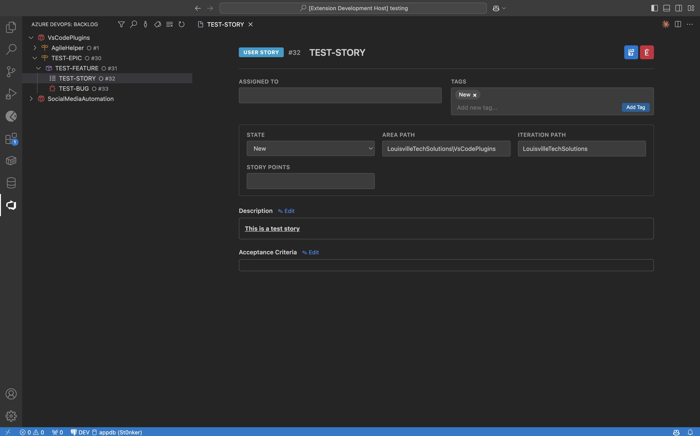

# Azure DevOps Backlog Explorer

Browse, edit, and manage your Azure DevOps backlog without leaving VS Code.



## Features

- **Hierarchical backlog tree** — Epics > Features > User Stories / Bugs, organized by area path right in the sidebar
- **ADO-styled work item panels** — Color-coded type badges, inline title editing, rich text description and acceptance criteria
- **Create work items** — Right-click any node to create Epics, Features, User Stories, or Bugs with automatic parent linking
- **Full field editing** — Title, state, iteration, assigned to, tags, description, and acceptance criteria
- **Assigned To autocomplete** — Team members load in the background and appear as suggestions as you type
- **Rich text toolbar** — Bold, italic, headings, lists, links, tables, font color, and highlighting — all compatible with ADO's rich text format
- **Powerful filtering** — Search by title or ID, filter by iteration path, tags, or assigned person
- **Drag and drop** — Reparent work items by dragging them between nodes in the tree
- **Quick actions** — Change state, delete, or jump to the Azure DevOps web UI from the context menu
- **Team info** — View team members for any configured area path

## Getting Started

### Prerequisites

- VS Code **v1.85.0** or later
- An Azure DevOps organization and project
- A [Personal Access Token (PAT)](https://learn.microsoft.com/en-us/azure/devops/organizations/accounts/use-personal-access-tokens-to-authenticate) with **Work Items (Read & Write)** scope

### Installation

Install from a `.vsix` file:

1. Download or build the `.vsix` (see [Building from source](#building-from-source) below)
2. In VS Code: **Extensions** sidebar > `...` menu > **Install from VSIX...**
3. Select the `.vsix` file and reload

### Configuration

Open **Settings** (`Cmd+,` / `Ctrl+,`) and search for **adoBacklog**, or add directly to `settings.json`:

```jsonc
{
  "adoBacklog.organizationUrl": "https://dev.azure.com/yourorg",
  "adoBacklog.personalAccessToken": "your-pat-here",
  "adoBacklog.project": "YourProject",
  "adoBacklog.areaPaths": [
    "YourProject\\TeamA",
    "YourProject\\TeamB"
  ],
  "adoBacklog.defaultIterationPath": "YourProject\\Sprint 1"
}
```

| Setting | Required | Description |
|---------|----------|-------------|
| `organizationUrl` | Yes | Your Azure DevOps org URL |
| `personalAccessToken` | Yes | PAT with Work Items read/write scope |
| `project` | Yes | Project name |
| `areaPaths` | Yes | Area paths to show in the tree (backslash-separated) |
| `defaultIterationPath` | No | Default iteration assigned to new work items |

> All settings are prefixed with `adoBacklog.` (e.g. `adoBacklog.organizationUrl`).

### Usage

1. Click the **Azure DevOps** icon in the activity bar
2. Expand an area path to browse Epics, Features, and child items
3. Click any work item to open the detail panel
4. Edit fields and hit the save icon in the header

## Building from Source

```bash
git clone <repo-url>
cd AzureDevOpsBacklogExplorer
npm install
npm run compile
```

To package as a `.vsix`:

```bash
npx @vscode/vsce package --allow-missing-repository
```

To run in development mode, press **F5** to launch an Extension Development Host. Use `npm run watch` for live recompilation.

## Testing

```bash
npm test
```

Tests run in a VS Code Extension Development Host via `@vscode/test-electron`. Test files are in `src/test/` and use the Mocha `suite`/`test` pattern.

## Contributing

1. Fork the repo and create a feature branch
2. Make your changes — ensure `npm run compile` passes cleanly
3. Add or update tests in `src/test/` for new functionality
4. Open a Pull Request with a clear description of the change

### Architecture overview

| File | Purpose |
|------|---------|
| `src/extension.ts` | Extension entry point, command registration, webview panel HTML |
| `src/adoService.ts` | Azure DevOps API client with 5-min TTL caching |
| `src/adoBacklogProvider.ts` | Tree data provider, drag-and-drop, filtering, pagination |
| `resources/icon.svg` | Activity bar icon |

### Guidelines

- All ADO API calls go in `adoService.ts` — use the `getCached`/`setCache` pattern for caching
- New commands must be registered in both `extension.ts` and `package.json` (`contributes.commands` + `contributes.menus`)
- Webview styles are scoped inside each panel's `<style>` block
- Test against a real Azure DevOps project before submitting

## License

ISC
